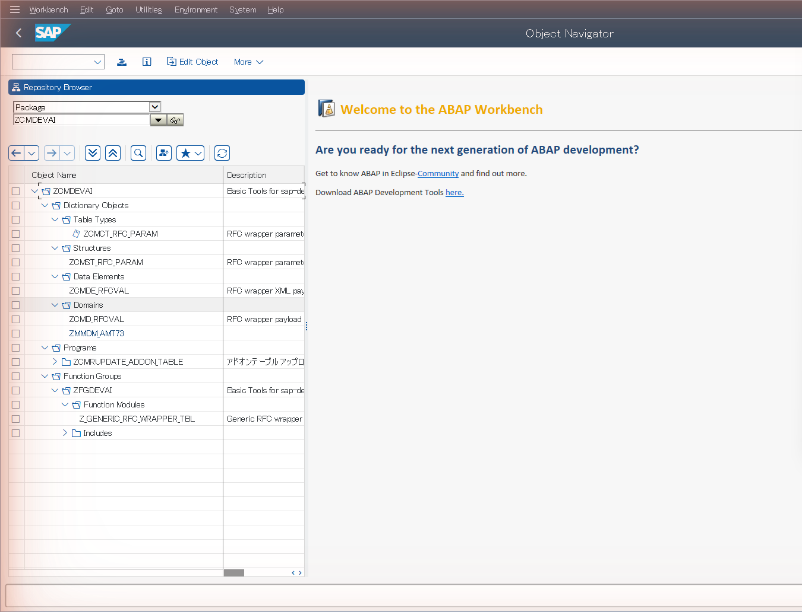
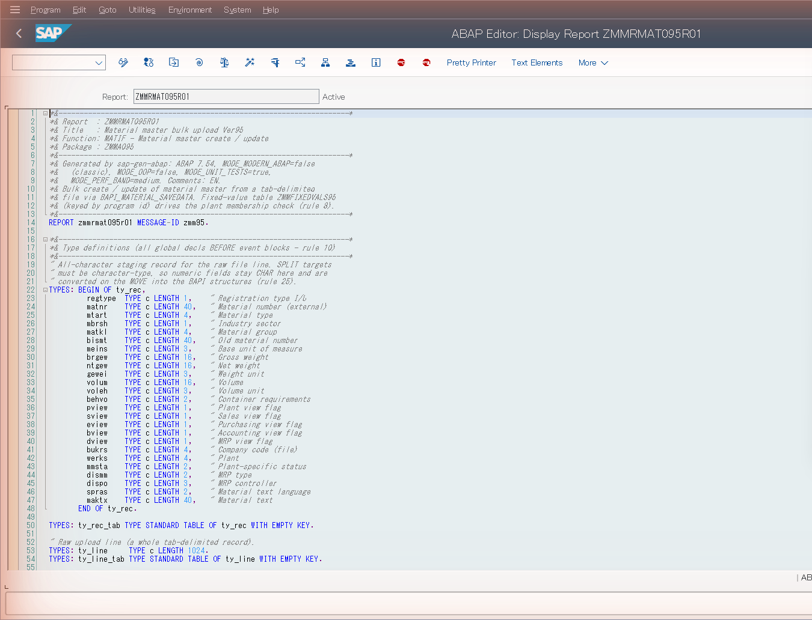

# sap-dev — SIer 開発者マニュアル

**クリーンな Windows ノート PC から、デプロイ済み・ATC クリーンな ABAP まで — Claude Code スキルを使って。**

> 対象読者: システムインテグレーター（SIer）で顧客プロジェクトに参画した ABAP 開発者
> /コンサルタントで、移送・品質ゲート・本番システムのコントロールを手放すことなく、
> **sap-dev** プラグインを使ってカスタムコードをより速く生成・デプロイしたい方。
>
> 読了時間: 約 30 分。実際の初回実行: 約 1 時間（その大半は一度きりのセットアップ）。

> 📖 これは英語版マニュアル [`manual.md`](manual.md) の日本語訳です。**正本は英語版**です。記述に差異がある場合は英語版が優先されます。

---

## 目次

0. [このツールキットとは（そして何ではないか）](#0-このツールキットとはそして何ではないか)
1. [エンドツーエンドの全体像](#1-エンドツーエンドの全体像)
2. [前提条件 — ワークステーションと SAP ユーザー](#2-前提条件)
3. [プラグインのインストール](#3-プラグインのインストール)
4. [初回セットアップ（マシンごと/システムごとに一度）](#4-初回セットアップ)
5. [ジェネレーターにプロジェクトを伝える — Customer Brief](#5-customer-brief)
6. [設計書から ABAP を生成する](#6-設計書から-abap-を生成する)
7. [コードのデプロイ](#7-コードのデプロイ)
8. [品質ゲート — ATC と ABAP Unit](#8-品質ゲート)
9. [移送のレディネス、リリース、STMS](#9-移送のレディネスリリースstms)
10. [完全な実践例 — そして `abap-developer` エージェント](#10-完全な実践例)
11. [Day-2 スキル: 診断、修正、解説、移行](#11-day-2-スキル)
12. [ツールキットがあなたを守る仕組み](#12-安全性モデル)
13. [トラブルシューティング & FAQ](#13-トラブルシューティング--faq)
14. [付録 A — 全スキルカタログ](#付録-a--全スキルカタログ)
15. [付録 B — 設定リファレンス](#付録-b--設定リファレンス)
16. [付録 C — ABAP の命名規則と長さ制限](#付録-c--abap-の命名規則と長さ制限)

---

## 0. このツールキットとは（そして何ではないか）

**sap-dev** は 4 つの Claude Code *プラグイン* のセットです。各プラグインは「スキル」（`/sap-…`
スラッシュコマンド）の集まりで、SAP が標準で提供する 2 つのインターフェースを介して、
**あなた自身のダイアログユーザーで実際の SAP システムを操作**します。

- **SAP GUI Scripting**（SAP GUI for Windows を駆動する VBScript）— トランザクションに
  関わるすべてのもの: SE38、SE37、SE24、SE11、SE91、SE01、ATC、…
- **RFC**（SAP .NET Connector / NCo 3.1 経由）— 読み取りチェックとファストパス
  （テーブル読み取り、FM シグネチャ、移送ステータス、有効化の検証）。

| プラグイン | スキル | 提供するもの |
|---|---|---|
| **sap-dev-core** | 50 + `abap-developer` エージェント | ログイン & 接続ストア、移送処理、ABAP ワークベンチ（SE38/SE37/SE24/SE11/SE91/SE16N/SE01/…）、ATC 品質ゲート、ABAP Unit ランナー、有効化、診断（ST22/SM13/SM12/SLG1/SM37）、デリバリーアシュアランス、QAS/PRD への **STMS** インポート。 |
| **sap-gen-code** | 8 | **仕様 → ABAP** パイプライン: 設計書（Excel/Word/PDF）の読み込み、検証、プロジェクトに合わせた ABAP 生成、実システムに対する生成結果の検証。 |
| **sap-migrate** | 8 + `cc-migration-engineer` エージェント | S/4HANA カスタムコード移行を追跡可能なキャンペーンとして実施。 |
| **sap-tcd** | 3 | 業務トランザクションの自動化: BP、MM01/02/03、VA01/02/03。 |

### これは何**ではない**か

- 顧客の本番システムをひそかに書き換える**ロボットではありません**。
  取り返しのつかないすべてのアクション（デプロイ、リリース、**本番インポート**）には
  ゲートが設けられ、必ず先に確認を求めます。[§12](#12-安全性モデル) を参照。
- SAP 標準テーブルに対して SQL を書き込むことは**しません** — SAP 自身の書き込み API
  （`BAPI_*`、`RPY_*`、`DDIF_*`、…）を介してのみ行います。読み取りは常に許可されます。
- **あなたの** SAP ライセンスと **あなたの** 権限のもとで動作します。SE21 で手作業で
  パッケージを作成できないなら、スキルにもできません。

> ⚠️ **必ずサンドボックス/DEV クライアントで開始してください。** プロジェクト自身の
> ライセンス注記より: 「本番システムに対する使用は自己責任で。必ず先にサンドボックスまたは
> 開発クライアントでテストすること。」

---

## 1. エンドツーエンドの全体像

新しいカスタムレポートやインターフェースの「ハッピーパス」は次のようになります:

```
                        ┌─────────────────────────────────────────────┐
   ONE-TIME SETUP       │  install plugins → /sap-login → /sap-dev-init │
                        └─────────────────────────────────────────────┘
                                            │
        design doc (.xlsx/.docx/.pdf)       ▼
   ┌───────────────────────────────────────────────────────────────────┐
   │  GENERATE                                                          │
   │  /sap-docs-extract → (/sap-docs-convert) → /sap-docs-check         │
   │        → /sap-gen-abap → /sap-check-abap (+/sap-fix-abap)           │
   │  (docs-check runs ddic+process dimensions; check-abap covers        │
   │   naming·types·SQL·fm·syntax dimensions)                            │
   └───────────────────────────────────────────────────────────────────┘
                                            │   Z<PROG>.abap (+ sibling files)
                                            ▼
   ┌───────────────────────────────────────────────────────────────────┐
   │  DEPLOY                                                            │
   │  /sap-se11 (DDIC) → /sap-se91 (messages) → /sap-se38|se37|se24      │
   │            → /sap-activate-object  (text elements for reports)      │
   │  …each pulls a transport request via /sap-transport-request        │
   └───────────────────────────────────────────────────────────────────┘
                                            │
                                            ▼
   ┌───────────────────────────────────────────────────────────────────┐
   │  PROVE                                                             │
   │  /sap-atc  →  /sap-run-abap-unit                                    │
   └───────────────────────────────────────────────────────────────────┘
                                            │
                                            ▼
   ┌───────────────────────────────────────────────────────────────────┐
   │  SHIP                                                              │
   │  /sap-transport-readiness → /sap-se01 release → /sap-stms import   │
   │                                          DEV → QAS → (typed-SID) PRD │
   └───────────────────────────────────────────────────────────────────┘
```

すべてのステップを使う必要はありません。最小限の有用なループは
`/sap-login` → ABAP を書く/貼り付ける → `/sap-se38` → `/sap-atc` です。それ以外はすべて、
顧客のランドスケープ上でこのループを *信頼できる* ものにするために存在します。

**あなたが主導権を握り続けます。** Claude は提案し、あなたが承認します。任意の単一スキルを
単独で、任意の順序で実行できます。上記のチェーンは推奨される順序であって、レールではありません。

---

## 2. 前提条件

### 2.1 ワークステーション

| 要件 | 理由 | 確認方法 |
|---|---|---|
| **Windows 10 / 11** | SAP GUI Scripting は Windows 専用。認証情報は Windows DPAPI で暗号化される | `winver` |
| **SAP GUI for Windows 7.70+** | すべてのトランザクション駆動スキル | SAP Logon → バージョン情報 |
| **SAP GUI Scripting 有効化（クライアント側）** | VBScript エンジンが許可されている必要がある | §2.3 を参照 |
| **Claude Code CLI** | スキルを実行するホスト | `claude --version` |
| **SAP .NET Connector 3.1（32-bit、.NET 4.0）** *（任意だが推奨）* | RFC ファストパス: TR ステータス、FM シグネチャ、有効化検証、テーブル読み取り | §2.4 を参照 |
| **Python 3.10+** *（任意）* | `sap-gen-code` のドキュメントパイプラインの一部で使用 | `py --version` |

> **シェルに関する注記（Windows で重要）。** `claude` は **好きなシェル**（cmd、PowerShell、
> Windows Terminal）から起動してください。それによってスキルの動作が変わることはありません:
> スキルは内部で常に **Windows PowerShell 5.1** + 32-bit `cscript` を使用します。**`pwsh` は
> 不要です。** CJK 対策として `chcp 65001` や「ベータ: Unicode UTF-8 を使用」を設定**しないで
> ください** — レガシー/SAP ツールが壊れます。CJK の正確性はスキルに組み込まれています。
> CJK 文字を単に *表示* したいだけなら、CJK フォントの Windows Terminal を使ってください。
> （詳細: [`docs/windows-shell-and-encoding-faq.md`](windows-shell-and-encoding-faq.md)。）

### 2.2 SAP サーバー側のスイッチ

SAP GUI Scripting は **両側** で有効化されている必要があります。サーバー側はプロファイル
パラメーター **`sapgui/user_scripting = TRUE`**（RZ11 で設定、RZ10 で永続化）です。
Basis チームがこれを管理している場合は、DEV システムで `TRUE` になっていることを確認するよう
依頼してください。読み取り専用のチェックが組み込まれています — [§4.4](#44-すべてが健全か確認する--sap-doctor) の
`/sap-doctor` を参照。

### 2.3 クライアントで SAP GUI Scripting を有効化する

**SAP Logon → オプション（Alt+F12）→ アクセシビリティ & スクリプティング → スクリプティング →**
で **スクリプティングを有効化** にチェックを入れ、「スクリプトが SAP GUI にアタッチした際に
通知する」と「スクリプトが接続を開いた際に通知する」の*チェックを外して*、スキルがポップアップで
止まらないようにします。その後 SAP Logon を再起動してください。

### 2.4 SAP NCo 3.1（RFC）— ダウンロードすべきもの

RFC 機能には [SAP .NET Connector 3.1](https://support.sap.com/en/product/connectors/msnet.html)
が必要です。

> ✅ **まず確認 — すでに入っているかもしれません。** **SAP GUI 7.7** をインストールした場合、
> NCo 3.1 は GAC に自動的に展開されていることがよくあります。何かをダウンロードする前に、
> 次の **両方** のファイルが存在するか確認してください:
>
> ```text
> C:\Windows\Microsoft.NET\assembly\GAC_32\sapnco\v4.0_3.1.0.42__50436dca5c7f7d23\sapnco.dll
> C:\Windows\Microsoft.NET\assembly\GAC_32\sapnco_utils\v4.0_3.1.0.42__50436dca5c7f7d23\sapnco_utils.dll
> ```
>
> **両方** が存在すれば完了です — **ダウンロードもインストールも不要**です。（正確な
> バージョンフォルダは多少異なる場合があります。`GAC_32` 内に `v4.0_3.1.0.*` の 32-bit
> `sapnco` + `sapnco_utils` のペアがあれば動作します。）

見つからない場合、**プラグインは SAP バイナリを同梱していません** — S-User アカウントを使って
SAP Service Marketplace から自分でダウンロードしてください。**32-bit、.NET Framework 4.0**
ビルドが必要で、**GAC にインストール**します（インストーラーオプション「アセンブリを GAC に
インストール」）。NCo がなくてもすべて動作しますが、RFC ベースの検証は GUI のみにフォール
バックするか、スキップされます。

### 2.5 DEV で必要となる SAP 権限

あなたはあなた自身として操作します。フルフローを実行するには、次のことができる開発者である
必要があります:

- `S_DEVELOP` — プログラム、FM、クラス、パッケージ、関数グループの作成/変更。
- `S_CTS_ADMI` / 移送権限 — 移送要求の作成とリリース（または Basis に TR を事前作成して
  もらう）。
- DDIC 権限（`S_DDIC_ALL` または同等）— ドメイン/データエレメント/構造の作成。
- システムがまだ SSCR を強制している場合は **開発者キー/登録**（最近のシステムの多くは
  強制しません）。

いずれかが欠けている場合、該当スキルは SAP エラーとともに明示的に失敗します — 成功を
偽ることは決してありません。

---

## 3. プラグインのインストール

`claude` セッション内で、マーケットプレイスを追加してインストールします:

```text
/plugin marketplace add https://github.com/sapdev-ai/sap-dev
/plugin install sap-dev-core@sap-dev
```

`sap-dev-core` は基盤であり、唯一必須のプラグインです。必要に応じて他のものを追加してください:

```text
/plugin install sap-gen-code@sap-dev      # spec → ABAP generation
/plugin install sap-migrate@sap-dev       # S/4HANA custom-code migration
/plugin install sap-tcd@sap-dev           # BP / MM01 / VA01 automation
```

> ℹ️ **`/plugin install` コマンド 1 つにつき 1 プラグイン** をインストールしてください —
> 上記の行は個別に実行します。（Claude Code は現在、1 回の `/plugin install` で複数の
> プラグインを受け付けません。）

**新しいスキルを有効化する。** プラグインをインストール（または更新）した後、セッションが
新しい `/sap-*` スキルを認識するようにリロードします:

```text
/reload-plugins
```

**Claude デスクトップアプリ**（ターミナル CLI ではなく）を使用している場合は、代わりに
**アプリを再起動**してください — `/reload-plugins` ではデスクトップのスキルリストが
完全には更新されないことがあります。

**確認**: `/` と入力すると、スラッシュコマンドのリストに `/sap-login`、`/sap-dev-init`、
`/sap-se38` などが表示されるはずです。`/reload-plugins`（またはデスクトップの再起動）後も
まだ表示されない場合は、`claude` セッションを再起動してプラグインを再スキャンさせてください。

> Claude に *話しかける* だけでも構いません。「SAP DEV システムにログインして」、
> 「データエレメント ZHKDE_AMOUNT を作って」、「このレポートをデプロイして」はすべて、
> 適切なスキルへディスパッチされます。スラッシュコマンドは明示的な形式で、自然言語は
> 日常的な形式です。

---

## 4. 初回セットアップ

一度きりの 3 つのアクション: **作業ディレクトリ** を選ぶ、**接続を保存** する、
**開発環境をブートストラップ** する。

### 4.1 作業ディレクトリを選ぶ（推奨、永続的）

ツールキットが書き出すすべて — 保存された接続、生成コード、ログ、キャッシュ — は 1 つの
**作業ディレクトリ**（デフォルト `C:\sap_dev_work`）の下に格納されます。プラグイン更新後も
残るよう、Windows ユーザーレベルで一度設定してください:

```powershell
# In a normal PowerShell window, once:
setx SAPDEV_AI_WORK_DIR "D:\sapdev"
```

`/sap-login` のオンボーディングでもこれを設定するか提案し、永続的なポインター
（`%APPDATA%\sapdev-ai\work_dir.txt`）を書き込むので、*現在の* セッションがすぐにそれを
拾います。スキップした場合は単に `C:\sap_dev_work` になります。

作業ディレクトリの下に格納されるもの:

| パス | 格納内容 |
|---|---|
| `runtime\connections.json` | 保存された SAP 接続（パスワードは DPAPI 暗号化） |
| `runtime\…` | セッション/ブローカー状態、接続ごとの開発デフォルト |
| `custom\` | プロジェクトのオーバーライド: `customer_brief.md`、命名規則、変換規則 |
| `design_docs\` | 入力設計書 |
| `source_code\` | 生成された ABAP + ドキュメントごとの作業フォルダ |
| `logs\` | 構造化 JSONL 実行ログ（`/sap-log-analyze` が読み取る） |
| `cache\fm_signatures\` | キャッシュされた FM シグネチャ（システムごと） |
| `temp\` | 実行ごとのスクラッチ |

### 4.2 SAP 接続を保存する — `/sap-login`

実行:

```text
/sap-login --add
```

接続詳細を尋ねられます。**すべて一度に提供してください** — スキルは SAP Logon 自身の
ランドスケープも読み取るので、「自分の S4D パッドエントリにログインして」と言うだけでも
構いません。エンドポイントには 2 つのスタイルがあります:

**アプリケーションサーバー（直接）接続**

| フィールド | 例 |
|---|---|
| `sap_logon_description` | `S4H [S42022.example.com]` |
| `sap_application_server` | `S42022.example.com` |
| `sap_system_number` | `00` |
| `sap_client` | `100` |
| `sap_user` | `DEVUSER` |
| `sap_password` | `••••••••` |
| `sap_language` | `EN` |

**メッセージサーバー（負荷分散）接続**

| フィールド | 例 |
|---|---|
| `sap_logon_description` | `S4D [msgsrv.example.com]` |
| `sap_message_server` | `msgsrv.example.com` |
| `sap_logon_group` | `PUBLIC` |
| `sap_system_id` | `S4D` |
| `sap_client` | `100` |
| `sap_user` | `DEVUSER` |
| `sap_password` | `••••••••` |
| `sap_language` | `EN` |

何が起こるか:

1. Claude が一回限りのログイン VBScript を生成し、SAP GUI を通じて接続します。
2. 依頼すれば、NCo を通じて RFC 接続性を検証します。
3. **プロファイルの保存** を提案し、パスワードを **Windows DPAPI** で暗号化します
   （`dpapi:…` として保存され、このマシン上のあなたの Windows アカウントでのみ復号可能）。
4. **この会話をこの接続にピン留め** するので、以降のすべてのスキルが正しいシステムを
   操作します。同じ SAP システムで 2 つ目の `claude` 会話を開いた場合、組み込みの
   *セッションブローカー* が別個の SAP セッションを生成し、両者が衝突しないようにします。

ログイン後は標準の **SAP Easy Access** メニューに到達し、CLI から操作できる状態になります。

**複数の顧客/システムの管理**（多数になります）:

```text
/sap-login --list                 # show every saved profile
/sap-login --switch S4D           # switch this conversation to S4D (by SID)
/sap-login --switch S4D/200/DEV2  # disambiguate by SID/client/user
/sap-login --set-default S4D      # default target for new conversations
/sap-login --delete <id>          # remove a profile (asks first)
/sap-login --check                # health-check all profiles (RFC, DNS, live sessions)
```

各会話は 1 つのプロファイルにピン留めされ、サブエージェントはそのピンを継承します。
これにより「顧客 A の QAS での私の修正」と「顧客 B の DEV での私のビルド」が決して
交差しないようにします。

### 4.3 開発環境をブートストラップする — `/sap-dev-init`

```text
/sap-dev-init
```

これは「サンドボックスを準備する」ステップです。**冪等** です — 再実行しても安全で、
存在するものをチェックし、欠けているものだけを作成します。次の順序で実行します:

1. **権限チェック** — ライブ GUI セッション（と RFC 用の認証情報）があることを確認します。
2. **自己修復** — 設定から古い/リリース済みの開発移送要求をクリアします。
3. **作業ディレクトリを SAP GUI Security で信頼する**（Windows アカウントごとに一度） — スキルが
   行うファイル IO が SAP GUI Security ポップアップでブロックされないようにします。
4. **移送要求** — TR ポリシー（後述）を尋ね、TR を解決/作成します。
5. **パッケージ** — 開発パッケージ（デフォルト `ZCMDEVAI`）を作成します。
6. **関数グループ** — 関数グループ（デフォルト `ZFGDEVAI`）を作成します。
7. **DDIC スキャフォールディング** — ドメイン `ZCMD_RFCVAL`、データエレメント `ZCMDE_RFCVAL`、
   構造 `ZCMST_RFC_PARAM`、テーブルタイプ `ZCMCT_RFC_PARAM`。
8. **汎用 RFC ラッパー FM** `Z_GENERIC_RFC_WRAPPER_TBL`（リモート対応としてマーク） —
   ツールキットが RFC 非対応の関数モジュールを RFC 経由で安全に呼び出せるようにします。
9. **ユーティリティプログラム** `ZCMRUPDATE_ADDON_TABLE` — `/sap-update-addon` が使用します。

**TR ポリシー**（`way_to_get_transport_request`）について尋ねられたら、1 つ選びます:

| ポリシー | 動作 | 適した用途 |
|---|---|---|
| `DEFAULT` | 1 つの常設開発 TR を再利用。空白/リリース済みの場合のみ尋ねる | サンドボックスでの単独開発 |
| `ASK` | 毎回どの TR を使うか尋ねる（記憶を提案） | 複数の TR をまたいで作業 |
| `CREATE_NEW` | 常に新しい TR を発行。永続化しない | オブジェクトごとに 1 TR の規律 |

新しい TR の **説明文** をどう構築するか（`ASK` / `PATTERN` / `FIXED` / `RANDOM`）も
選択します。これらの選択は **接続ごと** に保存されるので、各顧客システムが独自の
ポリシーを記憶します。

> 📷 *図 1 — `/sap-dev-init` が作成したオブジェクト。パッケージ `ZCMDEVAI`（SE80）に
> 表示されています。ラッパー FM、ユーティリティプログラム、DDIC スキャフォールディングが
> すべてここにあります。（スクリーンショットは英語版 SAP 画面）*
>
> 

**いつでも確認できます**（読み取り専用）:

```text
/sap-dev-status
```

アーティファクト（TR、パッケージ、関数グループ、ラッパー FM + その DDIC、ユーティリティ
プログラム）ごとに 1 行と `STATUS:` サマリーを出力します。終了コード 0 = 健全。

### 4.4 すべてが健全か確認する — `/sap-doctor`

最初の本格的なビルドの前に、読み取り専用のプリフライトを実行します:

```text
/sap-doctor
```

GUI スクリプティング、NCo/設定、RFC 接続性、クライアントの変更可能性、開発環境の
アーティファクトをチェックし、**失敗ごとに実行可能な FIX** を出力します。何も変更しません。
クリーンな `/sap-doctor` をゴーサインと見なしてください。

---

## 5. Customer Brief

これはプロジェクトごとに費やす中で最も価値のある 10 分です。**Customer Brief** は、
`/sap-gen-abap` にプロジェクトの *コンテキスト*（リリース、ネームスペース、パッケージ、
メッセージクラス、品質基準）を伝える 1 ページのフォームで、生成される ABAP が汎用的ではなく
顧客の標準に適合するようにします。

テンプレートを `custom` フォルダにコピーして記入します:

```text
{work_dir}\custom\customer_brief.md
```

（同梱テンプレートは `plugins/sap-dev-core/shared/templates/customer_brief.md` で、
記入済みの例は `customer_brief_sample.md` です。日本語版 `customer_brief_JA.md` は、
ログオン/テンプレート言語が JA の場合に自動選択されます。）

Brief が捕捉する内容（抜粋）:

| セクション | 制御するもの… |
|---|---|
| **1. システム** — ABAP リリース、Unicode、ログオン言語、タイムゾーン | モダン構文 vs クラシック構文、コードページ処理 |
| **2. ネームスペース & オブジェクト** — `Z`/`Y` プレフィックス、サブプレフィックス（`ZHK`）、デフォルトパッケージ、メッセージクラス | 生成される全オブジェクト名 |
| **3. 再利用可能ユーティリティ** — 優先すべき既存 Z クラス/FM | `MODE_REUSE` — 存在するものを再実装しない |
| **4. ボリューム** — オブジェクト種別ごとに小/中/大 | `SELECT SINGLE` vs `INTO TABLE` vs `PACKAGE SIZE` |
| **5. 権限** — 領域ごとの AUTHORITY-CHECK オブジェクト | 生成される権限チェック |
| **6. 品質基準** — ABAP Unit 必須? ATC ゲーティング? モダン構文? OOP? 最大メソッド長? コメント言語 | どの指摘がデプロイをブロックするか、コードの形 |

Brief は `/sap-docs-extract`、`/sap-gen-abap`（必須コンテキスト）、`/sap-check-abap`
（どの指摘がブロックするかを判断するため）によって読み取られます。一度記入すれば、
あらゆる仕様で効果を発揮します。

---

## 6. 設計書から ABAP を生成する

`sap-gen-code` パイプラインは、**設計書**（顧客が渡す機能仕様書 — Excel、Word、または PDF）を、
デプロイ可能な **検証済み ABAP ソース** に変換します。各ステップはプレーンテキストファイルを
1 つの *作業フォルダ* に書き出すので、どの段階でも検査や手作業の編集が可能です。

### 6.0 標準的な順序

```text
(/sap-docs-layout)        # optional: customise the spec workbook layout
 /sap-docs-extract        # REQUIRED: document → structured *.txt files
(/sap-docs-convert)       # optional: apply customer field/type/flag renames
 /sap-docs-check          # recommended: validate the spec (ddic + process dimensions)
 /sap-gen-abap            # REQUIRED: generate Z<PROG>.abap (+ sibling files)
 /sap-check-abap          # recommended: naming / types / SQL / contracts / coverage / CALL FUNCTION / syntax
 /sap-fix-abap            # if check-abap found auto-fixable issues
```

### 6.1 抽出 — `/sap-docs-extract`

```text
/sap-docs-extract C:\work\design\CustomerUpload.xlsx
```

入力は `.xlsx` / `.docx` / `.doc` / `.pdf`、既存の作業フォルダ、または `_raw.txt` です。
作業フォルダを作成し、ドキュメントを型付きテキストファイルにダンプします — 最も重要なもの:

| ファイル | 内容 |
|---|---|
| `{doc}_PGM_summary.txt` | プログラムの id/名前/タイプ/パッケージ/リリース |
| `{doc}_process.txt` | **処理ロジック — 生成の主要な入力** |
| `{doc}_domains.txt` / `_dataElements.txt` / `_tables.txt` | DDIC 定義 |
| `{doc}_selection_definition.txt` | 選択画面フィールド |
| `{doc}_errorMsgs.txt` | メッセージクラスのエントリ |
| `{doc}_textElements.txt` | テキストシンボル |
| `{doc}_interface.txt` | 入力/出力/例外（FM 用） |
| `{doc}_golden.txt` | テストシナリオ（→ ABAP Unit） |
| `{doc}_deps.txt` | 宣言された依存関係（FM、BAPI、テーブル） |

このステップは **オフライン** です — SAP 接続は不要です。

### 6.2 変換 *（任意）* — `/sap-docs-convert`

```text
/sap-docs-convert <work-folder> [<rules.tsv>]
```

抽出されたファイルに顧客固有の正規化ルール（レガシーフィールド名 → 正規名、レガシー
DDIC タイプ → 正規型、フラグ値 → キー/値）を適用します。仕様がすでにツールキットの想定する
形になっている場合は **スキップ** してください。最初に `.pre-convert/` スナップショットが
取られるので、元に戻せます。

### 6.3 仕様を検証する — `/sap-docs-check`

```text
/sap-docs-check <work-folder> [<sap-logon-description>]   # 既定で両ディメンションを実行
/sap-docs-check <work-folder> --dimension ddic            # DDIC ディメンションのみ
/sap-docs-check <work-folder> --dimension process         # プロセスディメンションのみ
```

1 つのスキル、2 つのディメンション（既定では入力ファイルが存在する両方を実行）:

- **ddic** ディメンションはドメイン/データエレメント/テーブルを検証します: 命名、有効な DDIC タイプ、
  CURR/QUAN 参照の完全性、ドメイン↔データエレメント↔テーブルの相互参照。ログオン説明を
  渡すと、RFC 経由で **実際の** ディクショナリに対しても検証します。
- **process** ディメンションは曖昧/矛盾するロジック、未定義のフィールド/テーブル、型の不一致を
  指摘します。任意で table.field 参照を実 SAP に対して検証します。

各ディメンションは Excel で開けるタブ区切りの `check_result_*.txt`（ddic / process）を書き出します。**問題のみが
リスト** されます — 結果が空ならクリーンということです。仕様テキストファイルで問題を修正し、
再実行してから先に進んでください。

### 6.4 生成 — `/sap-gen-abap`

```text
/sap-gen-abap <work-folder>\{doc}_process.txt
```

これは process ファイル、兄弟の `_*.txt` ファイル、**そしてあなたの Customer Brief** を
読み取り、RFC 経由で実際の FM/構造/権限のシグネチャを事前取得（システムごとにキャッシュ）し、
次を生成します:

| 出力 | 用途 |
|---|---|
| **`Z<PROGRAM_ID>.abap`** | 成果物 — ABAP ソース |
| `Z<PROGRAM_ID>.deps.txt` | 依存関係マニフェスト（Basis に渡す） |
| `Z<PROGRAM_ID>.messages.txt` | メッセージクラスの投入 → `/sap-se91` |
| `Z<PROGRAM_ID>.text_elements.txt` | 選択テキスト + テキストシンボル → `/sap-se38` |
| `Z<PROGRAM_ID>.traceability.txt` | 仕様セクション → ABAP 行の監査マップ |
| `Z<PROGRAM_ID>_TEST.abap` | ABAP Unit クラス（Brief がテストを要求した場合） |

**レポート/帳票（バッチ）**、**ダイアログ/モジュールプール** プログラム、
**関数モジュール / RFC** を生成できます。Brief が詳細を制御します: モダン構文 vs
クラシック構文、OOP vs FORM スキャフォールド、ボリューム帯ごとのパフォーマンスパターン、
AUTHORITY-CHECK の配置、メッセージクラス、コメント言語。

ジェネレーターは通常 ATC 指摘の原因となるルールをすでに強制しています — `SELECT *` なし、
クラスメソッド内の `MESSAGE e…` なし、`LOOP … WHERE … EXIT` なし、通貨フィールドは参照
フィールドを伴う、FM 呼び出しパラメーターは実シグネチャと一致する、など — そのためコードは
*最初からクリーンに近い* 状態で生まれます。

### 6.5 生成されたコードを検証する — `/sap-check-abap`

```text
/sap-check-abap <work-folder>\Z<PROGRAM_ID>.abap     # all dimensions (see below)
```

1 つのスキルに複数の **ディメンション** があります（旧 `/sap-check-fm` は `fm`
ディメンションになり、新たに `syntax` ディメンションが追加されました）:
- **naming / type / sql / unused / contract / spec / conv** — 変数命名（あなたのルールに対して）、
  データ型、SQL フィールド名、未使用変数、生成コントラクト（行長、`SELECT *`、メッセージ
  ルーティング、テキストシンボル）、そして**仕様カバレッジ**。デフォルトはオフライン。
  接続を追加するとライブの型/SQL 検証が可能です。
- **fm** — すべての `CALL FUNCTION` を RFC 経由で **実際の** FM シグネチャに対して検証します
  （パラメーター名、セクション、必須フラグ、型の互換性、構造フィールド）。幻覚パラメーターを
  SE37 到達前に捕捉します。
- **syntax** — ヘッドレスのコンパイラーレベル構文チェック（RFC 経由の `EDITOR_SYNTAX_CHECK`）。
  GUI アップロード前にオフラインで実構文エラーを捕捉します。自己完結プログラムで実行され、
  インクルード / FM フラグメント / クラスプールでは `SYNTAX_COULD_NOT_CHECK` を報告します
  （それらはデプロイスキルの Ctrl+F2 でインコンテキスト検証されます）。

自動修正可能なものが見つかった場合は修正ツールを実行します（最初にタイムスタンプ付きの
`.bak` が書き込まれます）:

```text
/sap-fix-abap <work-folder>\Z<PROGRAM_ID>.abap
```

`fix-abap` は命名違反のリネーム、未使用変数のコメントアウト、構文安全な書き換え、
`CALL FUNCTION` パラメーター修正（旧 `fix-fm`、統合済み）、および有界の AI 構文修正ループを
行います。安全に自動修正できないもの（例: `TYPE_NOT_FOUND`）はフラグ付けされます。
チェッカーがクリーンになるまで再実行してください。

各チェッカーはソースの隣にタブ区切りの結果ファイルを書き出します（check-abap の場合は
`Z<PROGRAM_ID>.check.tsv`） — 指摘ごとに 1 行で、Excel で開ける **Code**、**Severity**、
**Line**、**Fix Advice** の列があります。結果が空ならクリーンです。

---

## 7. コードのデプロイ

ここでアーティファクトを SAP に投入します。**順序が重要** です — それを使うプログラムの前に
DDIC を、それからメッセージするプログラムの前にメッセージクラスを:

```text
1. /sap-se11   <type> <name> <def-file>     # domains → data elements → structures → tables
2. /sap-se91   <MSGCLASS> <messages-file>   # populate the message class
3. /sap-se38   <PROGRAM>  <Z<PROG>.abap>    # (or /sap-se37 for FMs, /sap-se24 for classes)
4. text elements                            # apply Z<PROG>.text_elements.txt (reports)
```

すべてのデプロイスキルは: オブジェクトが存在するかチェック → 作成または更新 →
**構文チェック** → 保存 → **有効化** → そして RFC 経由で有効化を **検証**
（`PROGDIR.STATE = A`、`DWINACTIV`、ステータスバー `MessageType = S`）します。非アクティブな、
または構文的に壊れたオブジェクトについて成功を報告することは決してありません。

### 7.1 プログラム / レポート — `/sap-se38`

```text
/sap-se38 ZHKMM001R01 C:\sapdev\source_code\work\...\ZHKMM001R01.abap
```

ソースは **ファイルパスまたは貼り付けた ABAP** です。レポートの場合、スキルは有効化後に
選択テキスト/テキストシンボルのエレメント（生成された `.text_elements.txt` から）も適用します。
その他のモード: `check-and-fix`（ソースなし → 開く、構文チェック、修正、再アップロード、
有効化）、`change-attributes`（タイトル/ステータス/タイプ）、`delete`（先に確認）。

> 📷 *図 2 — `/sap-gen-abap` で生成され `/sap-se38` でデプロイされたレポート。S4G デモ
> システムの SE38 で **アクティブ** として表示されています。生成されたヘッダーコメント
> ブロックには、ジェネレーターが Customer Brief から導出した `MODE_*` フラグ（ABAP 7.54、
> クラシック構文、ユニットテストあり、中ボリューム帯、EN コメント）が記録されています。
> （スクリーンショットは英語版 SAP 画面）*
>
> 

### 7.2 関数モジュール — `/sap-se37`

```text
/sap-se37 Z_HK_UPLOAD_FILE C:\...\Z_HK_UPLOAD_FILE.abap --function-group=ZHKFG01
```

ソースは **完全な関数インクルード**（`*"Local Interface:` ブロックを含む
`FUNCTION … ENDFUNCTION.`）でなければなりません。モードには change-attributes（短いテキスト
/ 処理タイプ / リモート対応にする）、別の関数グループへの再割り当て、削除も含まれます。

### 7.3 クラス & インターフェース — `/sap-se24`

```text
/sap-se24 ZCL_HK_UPLOAD_PROCESSOR C:\...\ZCL_HK_UPLOAD_PROCESSOR.abap
/sap-se24 ZCX_HK_ERROR <file> --exception --with-message   # exception class tied to T100
/sap-se24 ZCL_HK_FOO <file> --test-source=<test.abap>        # deploy WITH local test classes
```

ソースは **完全な** `CLASS … DEFINITION … IMPLEMENTATION … ENDCLASS` です。（UTF-8/
エンコーディングの詳細はツールキットが処理します。）

### 7.4 DDIC オブジェクト — `/sap-se11`

```text
/sap-se11 DOMAIN       ZHKDM_AMT     <def.tsv>
/sap-se11 DATAELEMENT  ZHKDE_AMOUNT  <def.tsv>
/sap-se11 STRUCTURE    ZHKS_ITEM     <def.tsv>  --enhancement-category=NOT_EXTENSIBLE
/sap-se11 TABLE        ZHKT_LOG      <def.tsv>
```

**タブ区切りの定義ファイル** から、9 つの DDIC タイプすべて（テーブル、ビュー、データ
エレメント、構造、テーブルタイプ、タイプグループ、ドメイン、サーチヘルプ、ロック
オブジェクト）を扱います。参照されるドメイン/データエレメントを事前チェックし、
テーブル/構造の拡張カテゴリを設定し、有効化後にアクティブバージョンを RFC で検証します。
（削除モードも存在し、確認を伴います。）

> **定義ファイルの落とし穴:** `.def`/`.tsv` ファイルにはリテラル文字 `\t` ではなく、
> **実際の TAB バイト** が含まれている必要があります。プレーンなテキストツールで作成する
> 場合は、タブが本当にタブになっていることを確認してください。スキルは一般的な破損を
> 自動修復しますが、実際のタブが最も安全です。

### 7.5 メッセージクラス — `/sap-se91`

```text
/sap-se91 ZHKMSG01 <messages.txt>     # e.g. the generated Z<PROG>.messages.txt
```

メッセージはタブ区切りの `number<TAB>text`（プレースホルダ `&1`–`&4`）です。必要に応じて
クラスを作成し、テキストがすでに存在する場合は既存のメッセージ番号を再利用します。

### 7.6 取りこぼし — `/sap-activate-object`

何かが非アクティブのまま残っている場合（例: 有効化失敗）、単独で有効化します:

```text
/sap-activate-object PROGRAM ZHKMM001R01
/sap-activate-object CLASS   ZCL_HK_UPLOAD_PROCESSOR
```

タイプごとに適切なトランザクションにルーティングし、*非アクティブオブジェクトワークリスト*
ポップアップを自動処理し、`PROGDIR` / `DWINACTIV` で検証します。

### 7.7 移送の扱われ方 — デプロイスキルに TR を入力することは決してない

移送要求を必要とするすべてのデプロイスキルは、**`/sap-transport-request`** に尋ねます。
これは `way_to_get_transport_request` ポリシー（`DEFAULT` / `ASK` / `CREATE_NEW`）を適用する
単一のエントリポイントです。新しい TR が必要なときは `/sap-se01` に委譲します（デフォルトで
**ワークベンチ** 要求になり、説明文をテンプレートからレンダリングします）。ポリシーは
`/sap-dev-init` で一度設定します。その後、デプロイは単に *流れる* だけです — 適切な TR が
あなたのために解決され、タスク TR は会話ごとに分離されるので、並行作業が共有デフォルトを
決して壊しません。

必要に応じて TR を直接管理することもできます:

```text
/sap-se01 create W "ZHK month-end report"   # create a workbench TR
/sap-se01 release DEVK900123                 # release (asks first — irreversible)
/sap-se01 delete  DEVK900123                 # delete an unreleased TR (asks first)
```

---

## 8. 品質ゲート

### 8.1 ATC — `/sap-atc`

ABAP Test Cockpit をゲートとしてエンドツーエンドで実行します:

```text
/sap-atc PROGRAM ZHKMM001R01
/sap-atc PROGRAM ZHKMM001R01 --variant=S4HANA_READINESS --max-priority=2
```

オブジェクトセットを構築し、ATC 実行シリーズを作成・実行し、完了するまでモニターを
ポーリングし、**優先度 1 / 2 / 3** の指摘件数を読み取ります。`MAX_PRIORITY` ゲート
（デフォルト 2 → P1 **および** P2 がブロック、P3/P4 は警告）を適用し、指摘を TSV に
書き出します。FAIL の場合、自動的に指摘ごとの詳細にドリルダウンします。

```
RESULT: P1=0 P2=1 P3=3
VERDICT: FAIL          # because P2 ≤ MAX_PRIORITY(2)
FINDINGS_TSV: …\ZHKMM001R01.atc.tsv
```

オブジェクトタイプ: `PROGRAM`、`CLASS`、`INTERFACE`、`FUGR`、`DDIC`、…（関数モジュールの
場合は、その **FUGR** を渡します）。指摘を修正し（多くの場合 `/sap-fix-abap` または的を
絞った編集 + 再デプロイで）、`VERDICT: PASS` になるまで再実行します。

### 8.2 ABAP Unit — `/sap-run-abap-unit`

ジェネレーターがテストクラスを生成した場合（Brief がテストを要求したため）、実行します:

```text
/sap-run-abap-unit ZHKMM001R01_TEST
/sap-run-abap-unit ZCL_HK_UPLOAD_PROCESSOR --with-coverage --min-coverage=80
```

SE38/SE24 経由でユニットテストを実行し、メソッドごとの合否を報告し、判定を出します。
`--with-coverage` は追加でコードカバレッジを測定し、最小パーセンテージでゲートできます。

---

## 9. 移送のレディネス、リリース、STMS

### 9.1 リリース前ゲート — `/sap-transport-readiness`

リリースする前に、TR が実際に出荷可能か確認します:

```text
/sap-transport-readiness --current                 # the conversation's dev TR
/sap-transport-readiness DEVK900123 --run-atc --include-unit-tests --strict
```

RFC、読み取り専用。リリースされていない子タスク、非アクティブオブジェクト、移送可能要求に
含まれるローカル/$TMP オブジェクトをチェックし、（任意で）ATC と ABAP Unit の判定を組み込み
ます。すべてを **GO / GO_WITH_WARNINGS / NO_GO** にまとめ、指摘ごとの是正リストと正直な
「チェックできませんでした」セクションを付けます。

```
READINESS: tr=DEVK900123 verdict=GO_WITH_WARNINGS block=0 warn=2 info=1 objects=5
```

終了 0 = リリース安全。終了 1 = NO_GO、先に修正。

### 9.2 リリース — `/sap-se01 release`

```text
/sap-se01 release DEVK900123
```

要求とそのタスクをリリースします。**取り返しがつきません — 先に確認を求めます。**

### 9.3 ランドスケープを通して移動させる — `/sap-stms`

インポートキューとログを読み取り、リリース済み TR を DEV → QAS → PRD と通します:

```text
/sap-stms status DEVK900123 --route          # where is it in the route?
/sap-stms import DEVK900123 --to S4Q          # import into QAS
/sap-stms logs   DEVK900123 --system S4Q      # read the return code (RC) afterwards
```

`/sap-stms` は **実際のリターンコード** をインポートログから読み取ります（RC 0 = OK、
4 = 警告、8 = エラー、12 = 致命的） — キューの「完了」行を信用しません。

**本番は意図的に誤って実行しにくくなっています。** 本番システム（本番許可リストの SID）への
インポートには、スキルが TR のオブジェクト一覧を表示した後で、ターゲット SID を **打ち返し**、
明示的に確認することが必要です。ショートカットフラグはありません。これは、はぐれた
コマンドが本番に触れることを許さないツールキットの拒否姿勢です。

---

## 10. 完全な実践例

シナリオ: 顧客が `MaterialUpload.xlsx` を渡してきました。これは、マテリアルのファイルを
読み込んでそれらを作成するレポートの仕様です。あなたの Brief はサブプレフィックス `ZHK`、
パッケージ `ZHKA011`、メッセージクラス `ZHKMSG01`、ABAP Unit「必須」、ATC「優先度 1+2
ゲーティング」を設定しています。

```text
# --- one-time, already done: /sap-login, /sap-dev-init, customer_brief.md filled ---

# 1. Generate
/sap-docs-extract C:\sapdev\design_docs\MaterialUpload.xlsx
/sap-docs-check         C:\sapdev\source_code\work\MaterialUpload_20260626\
/sap-gen-abap C:\sapdev\source_code\work\MaterialUpload_20260626\MaterialUpload_process.txt
/sap-check-abap C:\sapdev\source_code\work\MaterialUpload_20260626\ZHKMM001R01.abap
#   → if findings: /sap-fix-abap … then re-check until clean

# 2. Deploy
/sap-se91 ZHKMSG01 C:\sapdev\source_code\work\MaterialUpload_20260626\ZHKMM001R01.messages.txt
/sap-se38 ZHKMM001R01 C:\sapdev\source_code\work\MaterialUpload_20260626\ZHKMM001R01.abap
#   (apply the generated text elements when prompted)

# 3. Prove
/sap-atc PROGRAM ZHKMM001R01 --max-priority=2
/sap-run-abap-unit ZHKMM001R01_TEST

# 4. Ship
/sap-transport-readiness --current --run-atc --include-unit-tests
/sap-se01 release <your-TR>
/sap-stms import <your-TR> --to S4Q
```

実際にはこれらの大半を入力することはありません — 「この仕様から MaterialUpload レポートを
生成し、チェックして、DEV にデプロイして」と言い、Claude が到達する各ゲートステップを
承認するだけです。上記のコマンドは内部で起こっていることです。

### 10.1 — ショートカット: ループ全体を `abap-developer` エージェントに任せる

§6–§8 のすべては、単一のサブエージェント — **`abap-developer`**（`sap-dev-core` に同梱）—
によってあなたのために駆動できます。これはシニア ABAP 開発者のペルソナで、あなたの
Customer Brief を読み、そこから `MODE_*` フラグを設定し、`/sap-*` スキルをエンドツーエンドで
オーケストレーションします。あなたは *結果* を記述し、エージェントがパイプラインを実行し、
各ゲートステップであなたの承認を求めて一時停止します。リクエストの言い回しによって選ばれる
**3 つのモード** があります:

| モード | こう言う… | 実行内容 |
|---|---|---|
| **build** | 「`…\MaterialUpload.xlsx` から `ZHKMM001R01` をビルドして DEV にデプロイして」 | extract → 仕様検証 → DDIC + メッセージクラス → 生成 → check/fix → **(あなたに尋ねる)** → デプロイ → 有効化 → テキストエレメント → ATC → ユニットテスト |
| **fix** | 「`ZHKMM001R01` を修正して」/「`ZLEGACY_RPT` を ATC クリーンにして」 | `/sap-check-fix` ディスパッチャー（最大 3 回の自動修正ラウンド）→ ATC 再チェック → レポート |
| **deploy** | 「`…\ZHKFOO.abap` を DEV にデプロイして」 | ソースを分類 → 依存関係を検証 → **(あなたに尋ねる)** → TR 解決 → デプロイ → ATC |

名前を指定して呼び出すか、タスクを言い回すだけで — Claude が自動的にディスパッチします:

> **あなた:** *abap-developer エージェントを使って、*
> *`C:\sapdev\design_docs\MaterialUpload.xlsx` から MaterialUpload レポートをビルドし、*
> *DEV にデプロイして。*

エージェントはそれから自律的に実行します:

1. **プリフライト** — 作業ディレクトリを解決し、`customer_brief.md` を読んで
   `MODE_OOP / MODE_UNIT_TESTS / MODE_PERF_BAND / ATC_MAX / …` を設定し、ライブ SAP
   セッションを確認し（必要なら `/sap-login` を実行）、**指定したシステムにピン留め
   されているか確認**し（「S4H にデプロイ」がひそかに S4D に着地できないように）、
   `/sap-dev-status` を実行して dev-init アーティファクトの存在を確認します。
2. **ビルド** — `/sap-docs-extract` → `/sap-docs-check`
   → 仕様の DDIC オブジェクト（`/sap-se11`）とメッセージクラス（`/sap-se91`）をデプロイ
   → `/sap-transport-request` → `/sap-gen-abap` → `/sap-check-abap`
   （全ディメンション、+ `/sap-fix-abap`、最大 3 ラウンド）。
3. SAP への最初の書き込みの前に **あなたに尋ねます**:
   > 「`ZHKMM001R01.abap`（320 行）を生成しました。テスト: `ZHKMM001R01_TEST.abap`
   > （4 メソッド）。品質チェックは合格。プラン: TR `DEVK900123` のもとでパッケージ
   > `ZHKA011` にデプロイし、有効化し、ATC 優先度 ≤ 2 を実行。続行しますか?
   > （yes / show source / cancel）」
4. **デプロイ + 検証** — あなたの *yes* で: `/sap-se38`（デプロイ → 有効化 → テキスト
   エレメント適用）→ `/sap-atc` → デプロイ + `/sap-run-abap-unit` を実行。
5. **最終レポート** — SUMMARY（モード、ステータス、オブジェクト、TR、ATC 結果、テスト）、
   ARTIFACTS リスト（ソース、deps、トレーサビリティ、トランスクリプト）、NEXT STEPS。

エージェントが契約上 **しないこと**（拒否する際にルールファイルを引用します）:

- あなたの明示的な「yes」なしに何かをデプロイすること（上記ステップ 3）。
- ABAP を手書きすること — 生成は常に `/sap-gen-abap` を通ります（手書きコードが参照できない
  ライブの FM / AUTHORITY-CHECK / DDIC 構造のキャッシュを持っています）。
- ATC 優先度 1/2 の指摘を回避すること — それらを表面化させ、あなたに判断させます。
- 仕様のオブジェクトをひそかにリネームすること — 名前が **ターゲットシステム上に** すでに
  存在する場合は停止して尋ねます（その場で再利用 / サフィックス付け / 中止）。
- SAP 標準テーブルに対して SQL を書くこと、または TR 番号を直接あなたに尋ねること。

すべてのスキル呼び出しは、監査 **トランスクリプト**（`{work_dir}\temp\abap_developer_transcript_*.txt`）に
追記されます — 翌朝に読める「何を、なぜしたか」の証跡です。

**実際の完全なプロンプト。** 実際には 1 行よりも豊富な指示を与えます —
エージェントは各句をステップまたは `MODE_*` フラグにマッピングします。実際のビルド
プロンプトは次のようになります（この仕様はリポジトリに同梱されているので、そのまま
実行できます）:

> *以下の設計書に基づいて、**abap-developer** を使って対応するプログラムを作成し、*
> ***S4D** システムにデプロイしてください。*
>
> *設計書で指定されたパッケージと新しい要求を作成し、このタスクのデフォルト選択として*
> *使用してください。*
>
> *以前に生成したコードの使用を避け、完全なプロセスを実行してください。*
> *SAP のログイン言語のテキストをコードコメントとして使用してください。*
>
> *プログラムをデプロイした後、このプログラムを使って 3 つのマテリアルを作成してください。*
>
> *ユニットテストプログラムを生成し、正常に実行してください。*
>
> *EN を使って SAP システムにログインしてください。*
>
> *見つかった問題を記録してください。*
>
> `C:\Work\Dev\ClaudeCodeDev\sapdev-ai\marketing\Sample\spec_MaterialUpload_EN.xlsx`

エージェントが各指示をどう読むか:

| あなたの言葉 | エージェントの動作 |
|---|---|
| 「**S4D** システムにデプロイして」+「**EN** を使って … ログインして」 | `/sap-login --lang EN` を実行し、それからセッションが **S4D** にピン留めされていることを確認（ステップ 0.3a） — 別の場所にピン留めされている場合は停止して尋ねる |
| 「設計書で指定されたパッケージと新しい要求を作成し、このタスクのデフォルト選択として使用して」 | 仕様のパッケージ + **新しい** 移送要求を解決して作成し、それらをこの会話の **セッション** 開発デフォルトとしてピン留めするので、以降のすべてのスキルが再利用する |
| 「以前に生成したコードの使用を避け、完全なプロセスを実行して」 | フルビルドパイプラインを新規に実行。仕様のオブジェクト名が **S4D 上で** 衝突しないことを RFC で検証し、そのまま使用（既存の名前を再利用/サフィックス付けする前に尋ねる） |
| 「SAP のログイン言語のテキストをコードコメントとして使用して」 | `MODE_COMMENT_LANG` をログオン言語（ここでは EN）に設定 |
| 「ユニットテストプログラムを生成し、正常に実行して」 | `Z…_TEST.abap` を生成してデプロイし、`/sap-run-abap-unit` を実行 — 失敗した実行はビルドを停止する |
| 「このプログラムを使って 3 つのマテリアルを作成して」 | 有効化後、デプロイされたレポートを実行して、スモークテストとして 3 つのマテリアルを作成 |
| 「見つかった問題を記録して」 | あらゆる問題を実行トランスクリプトに記録し、最終レポートで表面化させる |
| `…\spec_MaterialUpload_EN.xlsx` パス | `/sap-docs-extract` に渡される設計書 |

SAP への最初の書き込みの前の、唯一のゲートされた「続行しますか?」プロンプトは、依然として
あなたが承認します。

> 連携する **`cc-migration-engineer`** エージェント（`sap-migrate` 内）は、S/4HANA カスタム
> コード移行キャンペーンに対して、同種のオーケストレーションを行います。

---

## 11. Day-2 スキル

グリーンフィールドのビルド & デプロイを超えて、ツールキットは SIer が実際に最も時間を
費やす作業をカバーします:

**既存コードを理解する**

```text
/sap-explain-object PROGRAM ZLEGACY_REPORT     # source + call map + explanation dossier
/sap-where-used-list TABLE ZHKT_LOG            # cross-reference
/sap-impact-analysis PROGRAM ZLEGACY_REPORT    # risk band before you change it
/sap-compare PROGRAM ZHKMM001R01               # same object across two saved systems
/sap-explain-object ZHKMM001R01 --spec         # turn an object into a spec document
```

**インシデントを診断 & 修正する**

```text
/sap-diagnose "users get a dump posting goods receipt"   # fans out ST22/SM13/SM12/SLG1/SM37
/sap-st22 --deep                                          # short-dump detail
/sap-fix-incident <root-cause>                            # test-first fix in DEV, behind a TR
```

`/sap-fix-incident` は、根本原因から **テスト検証済み** のカスタムコード修正（移送の背後で
DEV にデプロイ）までのループを閉じます — ゲートされ、標準コードや本番には決して触れません。

**S/4HANA カスタムコード移行**（`sap-migrate` プラグイン）

```text
/sap-cc-campaign init        # start a tracked migration campaign
/sap-cc-inventory            # enumerate custom Z/Y objects in scope
/sap-cc-usage                # overlay runtime usage → what's actually used
/sap-cc-analyze              # S/4HANA-readiness ATC over the kept objects
/sap-cc-triage               # classify findings into remediation tiers
/sap-cc-remediate            # auto-fix the mechanical (R1) changes on a sandbox
```

---

## 12. 安全性モデル

ツールキットは顧客のランドスケープで信頼されるように作られています。保証:

- **SAP 標準テーブルへのひそかな書き込みなし。** 変更は SAP 自身の書き込み API を通ります。
  存在しない場合、スキルは停止して尋ねます。
- **求められていないデプロイなし。** スキルは、あなたが求めない限り（または、あなたが
  呼び出したデプロイスキルそのものでない限り）、オブジェクトを作成・デプロイしません。
- **取り返しのつかないすべてのアクションは確認する。** TR リリース、オブジェクト削除、
  **本番 STMS インポート** はすべて明示的な確認のために停止します。本番は加えて、SID を
  打ち返すことを要求します。
- **偽の成功なし。** デプロイは RFC 経由で有効化を検証し、ATC は実際の優先度列を読み取り、
  STMS は実際のリターンコードを読み取ります。「チェックできませんでした」はそのまま報告され、
  「合格」とされることは決してありません。
- **あなたの認証情報、あなたのマシン。** パスワードは DPAPI 暗号化され、このワークステーション上の
  あなたの Windows アカウントでのみ復号可能で、外に出ることはありません。
- **1 会話 = 1 SAP セッション。** セッションブローカーは、並行する会話が互いのセッションを
  駆動しないようにします。

---

## 13. トラブルシューティング & FAQ

**`/sap-login` が「Could not get SAP Scripting Engine.」と言う。**
クライアントでスクリプティングが無効になっています。有効化し（SAP Logon → オプション →
スクリプティング）、SAP Logon を再起動してください。それでも失敗する場合は、サーバー
パラメーター `sapgui/user_scripting` が `FALSE` です — Basis に `TRUE` への設定を依頼して
ください（RZ11）。

**スキルが「SAP GUI Security」ポップアップで止まる。**
それはファイル IO の信頼ダイアログです。`/sap-dev-init` のステップ 3 が現在の Windows
アカウントに対して作業ディレクトリを事前信頼します。再び現れる場合は、`/sap-dev-init` を
再実行してください（または、すべての SAP Logon ウィンドウを閉じて一度再起動し、ルールが
永続化されるようにします）。

**RFC ステップが「destination not found」/ NCo エラーと言う。**
SAP NCo 3.1 は **32-bit、.NET 4.0** ビルドを **GAC にインストール** したものでなければ
なりません。スキルは Windows PowerShell 5.1（32-bit）からそれを呼び出します。「アセンブリを
GAC にインストール」オプションで再インストールしてください。RFC 以外のすべては、それなしでも
動作します。

**TR がリリースされて、デプロイが失敗するようになった。**
`/sap-dev-init` は古い開発 TR を自己修復します。または新しいものを設定してください。
`way_to_get_transport_request=ASK` なら、次のデプロイで単に TR を尋ねられます。

**デプロイが「成功」したのにオブジェクトがアクティブでない。**
そうはなりません — スキルは有効化を RFC で検証し、偽の成功ではなく `ACTIVATION_FAILED` /
`COULD_NOT_CHECK` を報告します。報告された有効化ログ行を読んで原因を修正してください
（多くの場合、先にデプロイすべき DDIC 依存関係の欠落です）。

**CJK のコメント/テキストが文字化けする。**
`chcp` やシステムロケールを変更しないでください。スキルはあなたのコンソールに関係なく、
CJK を UTF-8 と RFC で正しく運びます。
[Windows シェル & エンコーディング FAQ](windows-shell-and-encoding-faq.md) を参照。
画面上で CJK を *表示* するには、CJK フォントの Windows Terminal を使ってください。

**2 つの顧客を同時に開いている。**
システムごとに 1 つの `claude` 会話を使い、それぞれを `/sap-login --switch <SID>` で
ピン留めしてください。ブローカーが SAP セッションを分離し、接続ごとの設定が各顧客の
TR ポリシー / パッケージ / 関数グループを別々に保ちます。

**生成したファイルはどこに行った?**
`{work_dir}\source_code\work\{doc_name}_{timestamp}\` の下です。作業フォルダは自動削除
されません — そこにある任意の `_*.txt` と `.abap` を検査または手作業で編集できます。

**スキルが何をしたかを見るには?**
`/sap-log-analyze` が JSONL 実行ログを要約します（スキルごとの件数、成功/失敗率、
p50/p95 の所要時間、上位エラークラス）。

---

## 付録 A — 全スキルカタログ

### sap-dev-core（基盤 + ABAP ワークベンチ）

| スキル | 目的 |
|---|---|
| `sap-login` | 接続 + マルチプロファイル接続ストア（DPAPI 暗号化）、AI セッションピン |
| `sap-dev-init` / `sap-dev-status` / `sap-dev-clean` | 開発環境のブートストラップ / レポート / 撤去 |
| `sap-doctor` | 失敗ごとに FIX を出す読み取り専用の環境プリフライト |
| `sap-transport-request` / `sap-se01` | TR 解決ポリシー / TR の作成・リリース・削除 |
| `sap-se38` / `sap-se37` / `sap-se24` / `sap-se11` / `sap-se91` | プログラム / FM / クラス / DDIC / メッセージクラスのデプロイ |
| `sap-se21` / `sap-function-group` | 開発パッケージ / 関数グループの作成・チェック・削除 |
| `sap-se41` / `sap-se51` / `sap-se54` | PF ステータス / 画面 / テーブルメンテナンスダイアログ |
| `sap-se16n` | 任意のテーブルをクエリ → タブ区切りダウンロード |
| `sap-se19` / `sap-cmod` | BAdI 実装 / 拡張プロジェクト |
| `sap-snro` | 番号範囲オブジェクト |
| `sap-activate-object` / `sap-change-package` / `sap-where-used-list` | 有効化 / パッケージ移動 / 相互参照 |
| `sap-atc` / `sap-run-abap-unit` | ATC ゲート / ABAP Unit ランナー |
| `sap-transport-readiness` / `sap-impact-analysis` / `sap-enhancement-advisor` / `sap-evidence-pack` | デリバリーアシュアランス |
| `sap-stms` | リリース済み TR をランドスケープを通してインポート（PROD はゲート） |
| `sap-diagnose` + `sap-st22` | インシデントトリアージ（SM13/SM12/SLG1/SM37 の RFC リーダーを内蔵、`--reader <name>` で単体実行）+ ST22 ダンプリーダー |
| `sap-sp02` | スプール出力リクエストの表示 / エクスポート |
| `sap-fix-incident` / `sap-check-fix` | テストファースト修正ループ / check-and-fix ルーター |
| `sap-trace` | 記録されたパフォーマンストレースを分析 |
| `sap-explain-object` / `sap-compare` | 理解（`--spec` で正式な仕様書を出力）/ クロスシステム差分 |
| `sap-rfc-wrapper` | RFC 非対応 FM（`fm`）/ クラスメソッド（`class`）を RFC 経由で呼び出し |
| `sap-call-bdc` / `sap-update-addon` | BDC 再生 / アドオンテーブルメンテナンス |
| `sap-gui-record` / `sap-gui-probe` / `sap-gui-inspect` / `sap-gui-skill-scaffold` | スキル作成 & GUI 堅牢性ツール（ゴールデンスクリーン差分 → `/sap-doctor --screens`）|
| `sap-log-analyze` / `sap-error-kb` | ログ要約 / 頻出エラーナレッジベース |

### sap-gen-code（仕様 → ABAP）

| スキル | 目的 |
|---|---|
| `sap-docs-layout` | 仕様ワークブックのレイアウトを編集 |
| `sap-docs-extract` | ドキュメント → 構造化 `_*.txt` ファイル |
| `sap-docs-convert` | 顧客正規化ルールを適用 |
| `sap-docs-check` | 仕様を検証（DDIC + 処理ロジックの各ディメンション） |
| `sap-gen-abap` | ABAP を生成（レポート / ダイアログ / FM） |
| `sap-check-abap` / `sap-fix-abap` | ABAP 品質を検証 / 自動修正 — 命名・型・SQL・CALL FUNCTION シグネチャ・コンパイラー構文 |

### sap-migrate（S/4HANA カスタムコード移行）

`sap-cc-campaign`、`sap-cc-inventory`、`sap-cc-usage`、`sap-cc-analyze`、
`sap-cc-triage`（`--learn` フライホイール含む）、`sap-cc-remediate`、`sap-cc-decommission`。

### sap-tcd（業務トランザクション）

`sap-bp`、`sap-mm01`、`sap-va01`。

---

## 付録 B — 設定リファレンス

ティアをまたいで解決されます（最優先が先頭）: env var `SAPDEV_AI_WORK_DIR`（work_dir のみ）→
`settings.local.json` → `{work_dir}\runtime\userconfig.json` → プラグインの `settings.json`。
これらを手作業で編集することはまれです — スキルが書き込みます。主なもの:

| キー | デフォルト | 設定者 |
|---|---|---|
| `work_dir` | `C:\sap_dev_work` | env var / `/sap-login` オンボーディング |
| `way_to_get_transport_request` | `DEFAULT` | `/sap-dev-init` |
| `sap_dev_transport_request` | 空白 | `/sap-dev-init`、`/sap-transport-request` |
| `sap_dev_package` | `ZCMDEVAI` | `/sap-dev-init` |
| `sap_dev_function_group` | `ZFGDEVAI` | `/sap-dev-init` |
| `rule_of_tr_description` / `tr_description_template` | `ASK` / 空白 | `/sap-dev-init` |
| `sap_dev_mode` | `GUI` | 接続ごと |
| `fm_cache_enabled` / `fm_cache_ttl_*_days` | `true` / 30 / 1 | userconfig |
| `log_*` | CLAUDE.md を参照 | userconfig |

接続ごとの開発デフォルト（TR / パッケージ / 関数グループ / モード / TR ポリシー）は
`connections.json[<id>].dev_defaults` に格納され、会話 × 接続ごとに分離されるので、
並行作業が共有デフォルトを決して壊しません。

---

## 付録 C — ABAP の命名規則と長さ制限

ジェネレーターとチェッカーがこれらを強制します。手作業で編集する際は把握しておいてください。

| オブジェクト | 最大長 | 規則 |
|---|---|---|
| `PARAMETERS` / `SELECT-OPTIONS` | プレフィックス込み **8** | `p_bukrs`、`s_matnr` |
| 変数 / クラス / メソッド / ローカルタイプ | **30** | `lv_…`、`ls_…`、`lt_…`、`gv_…`、`gc_…` |
| 関数モジュール / ドメイン / データエレメント / テーブル / 構造 | 30 | `Z…` / `Y…` |
| メッセージクラス / 関数グループ | 20 | `ZHKMSG01` / `ZHKFG01` |
| プログラム / レポート | 40 | `ZHKMM001R01` |
| グローバルクラス / 例外クラス | 30 | `ZCL_…` / `ZCX_…` |

変数プレフィックス（`abap_naming_rules.tsv`、プロジェクトごとにオーバーライド可能）:
`lv_`/`ls_`/`lt_` ローカル変数/構造/テーブル、`gv_`/`gs_`/`gt_` グローバル、`gc_`/`lc_`
定数、`p_` パラメーター、`s_` 選択オプション。

ソース規約: 行は ≤ 72 桁に保つ。仕様内のコメント/UI テキストはその自然言語で。コメントは
`MODE_COMMENT_LANG`（デフォルト = SAP ログオン言語）で。DDIC 定義ファイルは **実際の TAB**
バイトを使用。

---

*スキルは進化します — 迷ったときは、
各スキルの SKILL.md が真実の源であり、`/sap-doctor` が環境が準備できているかを教えてくれます。
質問: <https://github.com/sapdev-ai/sap-dev/issues> · <https://sapdev.ai>。*
